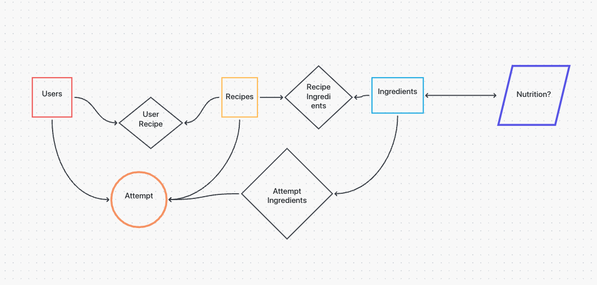

# Recipe Cache: A Demo Project by [Joe Senecal](https://github.com/josenecal)

### Project Status: IDEATION/TESTING
We're building some of the core infrastructure while balancing useful features with unnecessary gimics

---

### Welcome to the future of social recipe sharing!

Recipe Cache is a brand new* way of saving your recipes. Not only can you browse a library of recipes and save your favorites, but with Recipe Cache you can also track your attempts and variations on specific recipes. Trying to remember what you did with the Thanks Giving Day turkey last year that you swore never to do again? Or maybe how to make that dairy-free version of your favorite desert for a friend with a dietary restriction? Recipe cache helps you keep track of thosse details, whether you're dialing in the raios of your sourdough boule recipe, or making sure you get the details right for your child's once-a-year birthday cake, Recipe Cache lets you save the ingredients, the steps, and the outcomes of each attempt. So What are you waiting for? Take the guesswork out of cooking, and start making data-driven decisions, and turn the generic into the bespoke, with Recipe Cache. 

<table style="margin-right:auto;margin-left:auto" style="text-align:center">
    <tr>
        <a href="https://github.com/Josenecal/recipe-cache"><td style="text-align:center"> See The Code </td></a>
       <a href="https://recipe-cache.fly.dev"><td style="text-align:center"> Try The App </td></a>
    </tr>
    <tr>
        <td>
            
        </td>
        <td>
            
        </td>
    </tr>
</table>

---

### Development

#### Ideation

This project was inspired by a personal problem. Last year I started a new tradition, bringing cream puffs to the family Christmas dinner. It's a complicated, once-a-year recipe with any number of opportunities to screw up, and while I remembered that I'd done *something* wrong the year before, I had no earthly idea what.

I wanted to build a tool to help alleviate that problem, something that would let me digitize my recipes and save notes about what worked and what didn't, to help make those high-stakes decisions in a more data-driven way.

The ideation phase of this project started on a physical whiteboard, linking the core models of a User to a Recipe, and both of those to an Attempt. This being a barely viable concept, it was transfered to a digital whiteboard to better document the project.

These core concepts in place, the important question became **what other features would users find valuable?** With recipes and ingredients we could provide some of nutritional value for meals? Or maybe we can attach things like media to recipes and/or attempts? Should we organize recipes into libraries? Let uers keep their own recipes secret? Perhaps share them in the public library? Should we let users friend each other and make the app social? Maybe estimate ingredient costs and build shopping lists? And, most importantly, how do any of these features impact design choices regarding our core models? 

These are the questions that I am still answering as I begin to build out the core models and some basic UI for the very early phase of this project. To see a deployed version of this work in progress, you can go [here](https://recipe-cache.fly.dev) and register for a new account (or log in with an existing one!). 